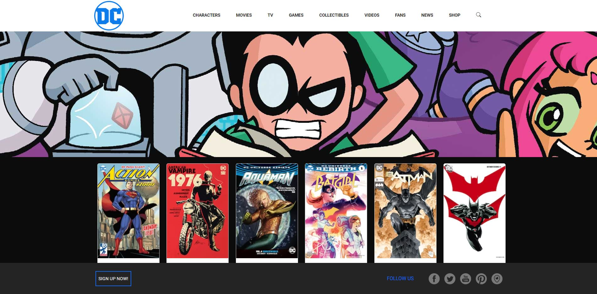

Esercizio: Laravel DC Comics

Nome Repo: laravel-dc-comics

Descrizione (Parte 1):

Creare un nuovo progetto Laravel 9 per gestire un archivio di fumetti.

Milestone 1:

Tramite gli appositi comandi artisan create un model con relativa migration e un resource controller.

Milestone 2:

Definire le operazioni CRUD con le relative view:
- index()
- show()
- create()
- store()

BONUS:

Creare il seeder per la tabella comics utilizzando il file in allegato.

Descrizione (Parte 2):

Definire le operazioni CRUD con le relative view:
- update()
- delete()

BONUS:

Tramite javascript, quando l'utente clicca sul pulsante "delete", chiedere conferma della cancellazione, prima di eliminare l'elemento.

Descrizione (Parte 3):

Aggiungere le validazioni in modo da rendere più stabile il vostro gestionale di fumetti.

BONUS:
- validare gli input ricevuti in fase di creazione e modifica, rispondendo con errori chiari e in italiano.
- utilizzare le Request personalizzate per validare i dati

<h1 align="center">Anteprima<h1>

